# 📚 eBook Platform

Welcome to the **eBook Platform** project! This web application offers users a seamless experience to explore, buy and sell eBooks. It comes with user-friendly interfaces for both admins and users, along with key features such as login and registration, admin controls, and more.

## 🛠️ Technologies Used

- **Frontend**: JSP (Java Server Page), Bootstrap
- **Backend**: Java
- **Database**: MySQL
## 🚀 Features

- **User Account**: Register and log in to access the eBook marketplace.
- **Admin Dashboard**: Manage books, users, and orders.
- **Sell and Buy Old Books**: Users can list old books for sale.
- **Shopping Cart**: Add books to the cart and proceed to checkout.
- **Order Management**: Track order history and current orders.

## 🖼️ UI Previews

### Homepage
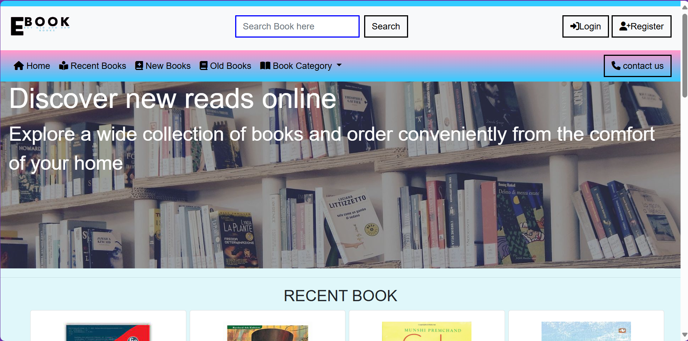  
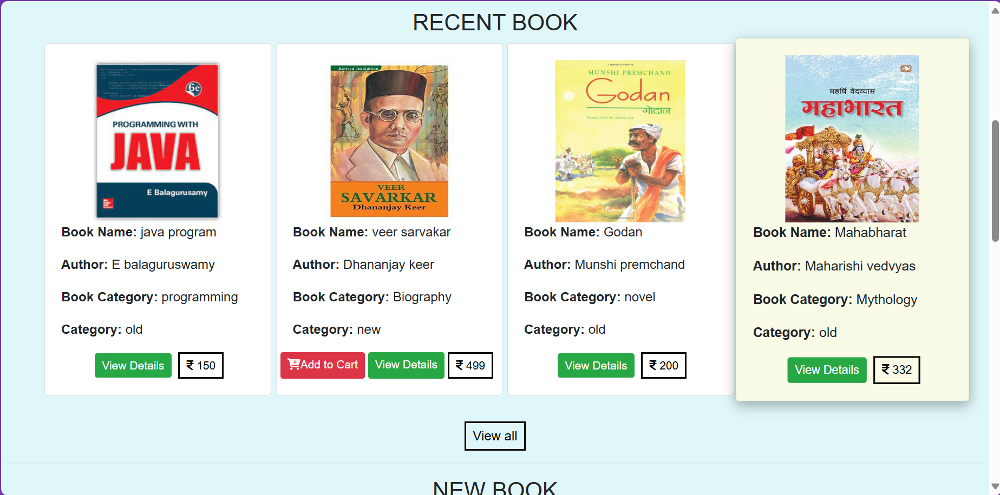  
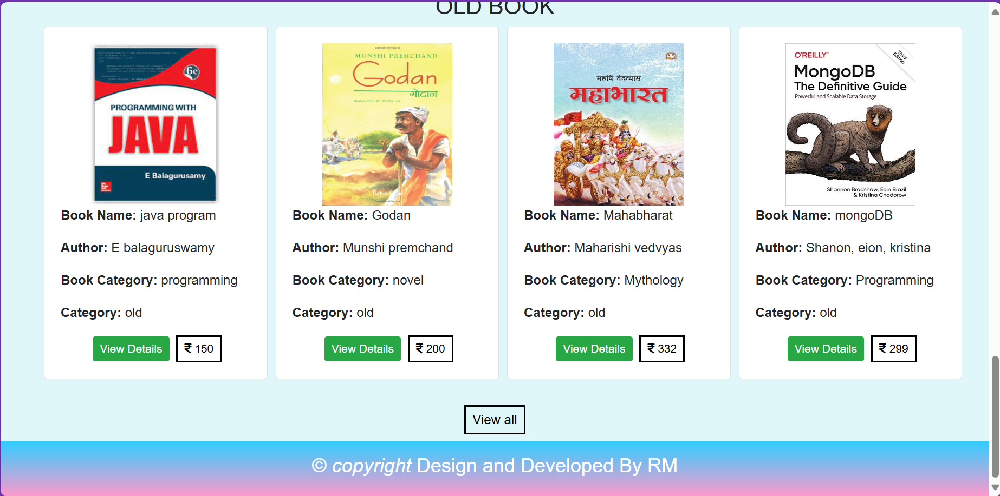

### Login and Registration Pages
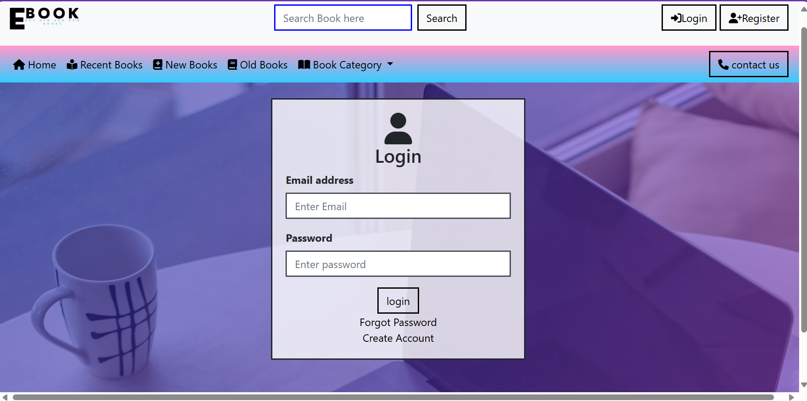  
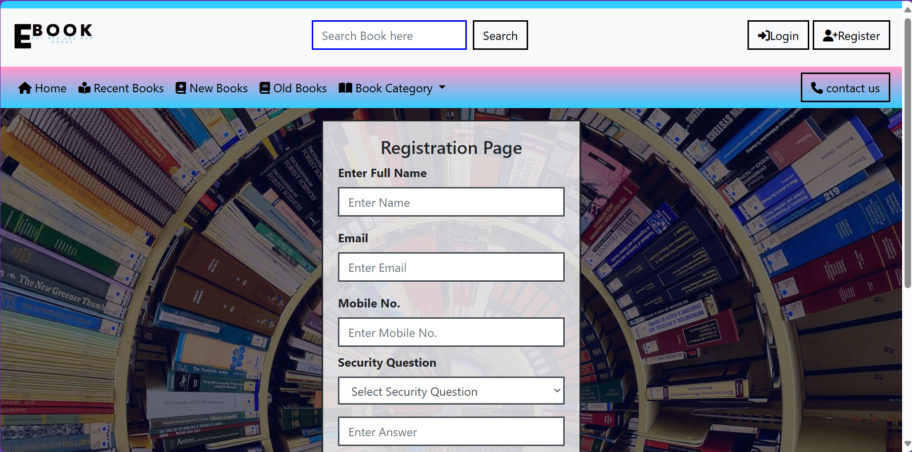

### Admin UI
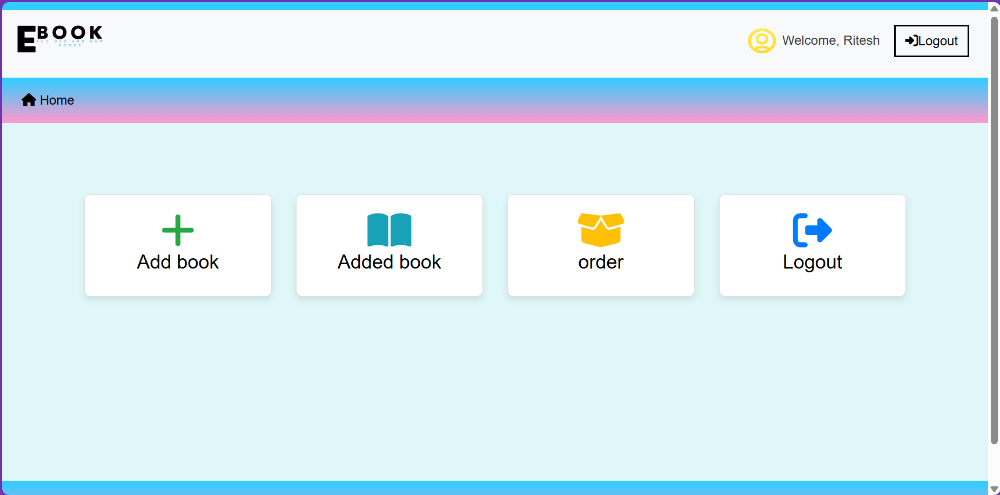  
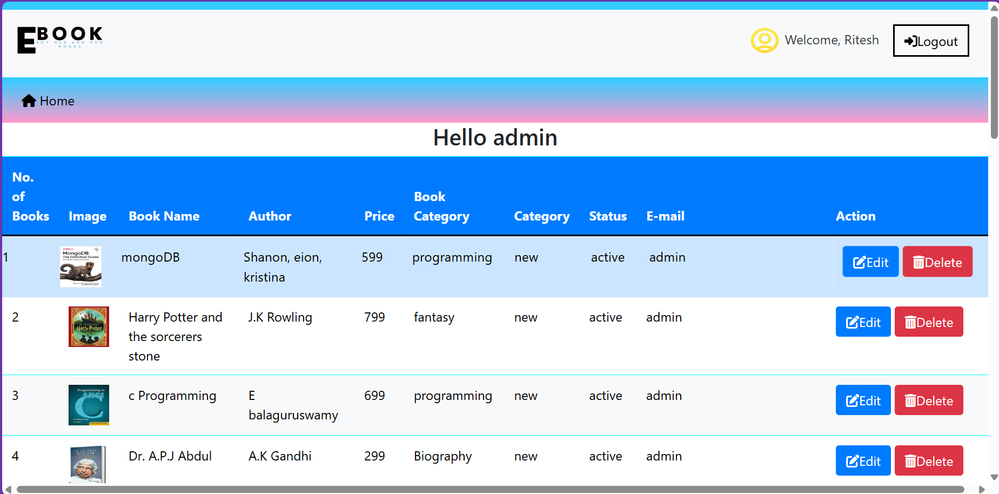  
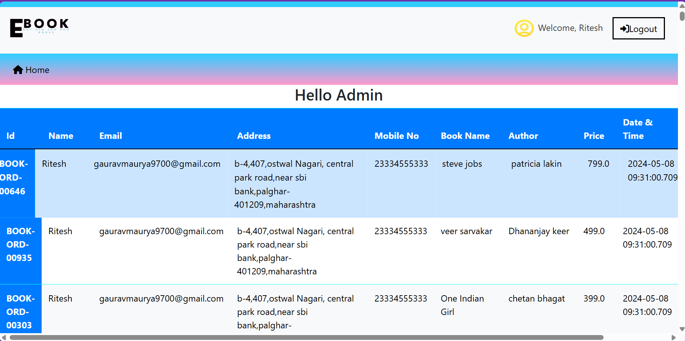

### User UI
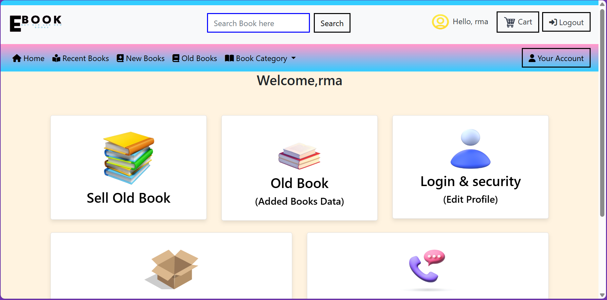  
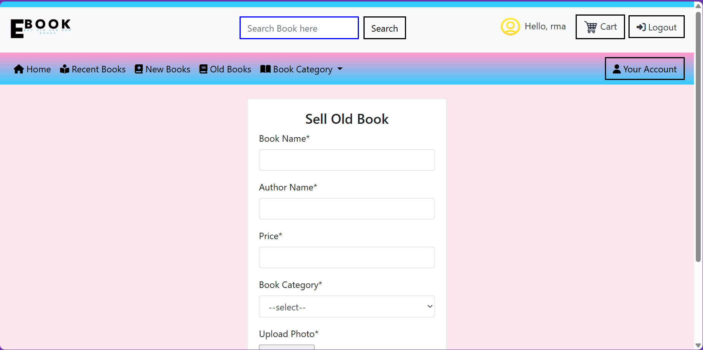  
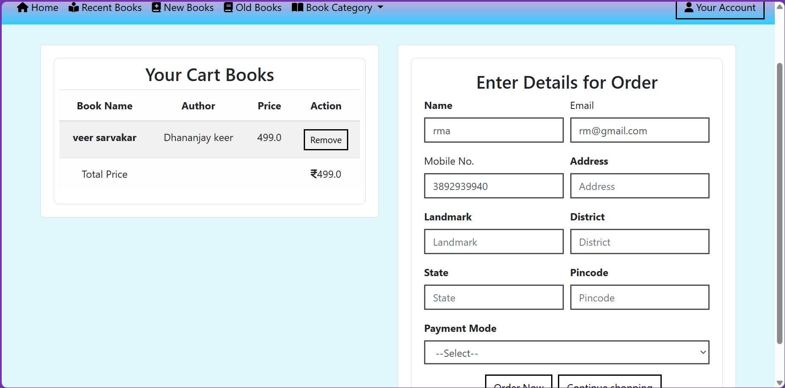
